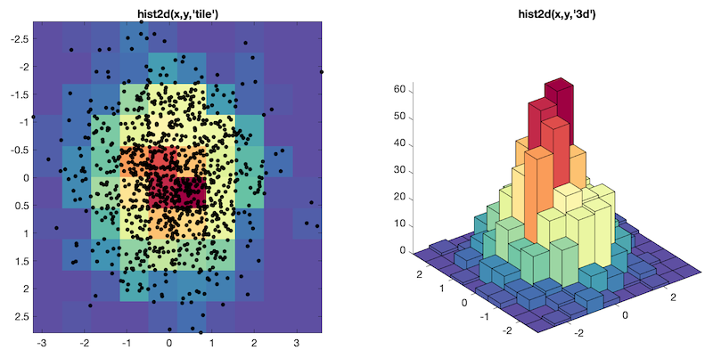

# 2-D histogram plot

## hist2d.m
Bivariable histogram plot function, release compatible, no toolbox. It mimics the core Matlab function `histogram2` introduced in R2015b. But `hist2d` uses full backward compatible language, without any dependency. It has been tested with R2011b and GNU Octave, but it should work with older releases.



`hist2d` creates a bivariate histogram plot of vectors X and Y as 2-D colored tiles or 3-D bars. The function uses an automatic binning algorithm that returns bins with a uniform area, chosen to cover the range of elements in X and Y and reveal the underlying shape of the distribution.

It is possible to specify the number of bins, the edges of the bins, and to normalize the bin counts matrix with several options (probability, count density, probability density function, cumulative counts, cumulative density function.

### Example
```matlab
x = randn(1000,1);
y = randn(1000,1);
hist2d(x,y)
```

## Author
**François Beauducel**, [IPGP](www.ipgp.fr), [beaudu](https://github.com/beaudu), beauducel@ipgp.fr

## Documentation
Type `doc hist2d` for help and syntax. See also [](https://fr.mathworks.com/matlabcentral/fileexchange/66629-2-d-histogram-plot) users community comments.
